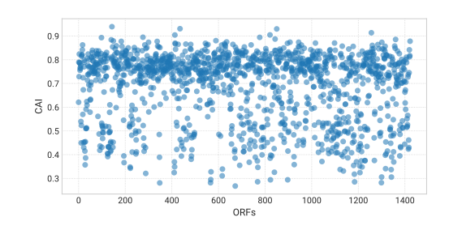

# Codon usage module

Lorem ipsum dolor sit amet, consectetur adipiscing elit. Proin consectetur rutrum tellus sit amet egestas. Aliquam faucibus condimentum mauris vitae rhoncus. Praesent laoreet rutrum purus, sed sodales neque. Quisque ut tincidunt erat, at rhoncus orci. Aliquam condimentum eget libero sed suscipit. Duis nec eros nec augue porta malesuada. Nulla nec nisl justo. Mauris eget augue a leo laoreet aliquam.

## How it works

Curabitur eget pellentesque erat. Vivamus et tristique urna. Maecenas non dapibus erat. Phasellus id massa eu erat gravida molestie at in lectus. Etiam vitae semper orci. Donec convallis blandit ornare. Morbi sodales odio orci, eget luctus leo iaculis sed.

$$
\mathit{RSCU}_{i,j} = \frac{x_{i,j}}{\frac{1}{n_i}\sum_{j=1}^{n_i}x_{i,j}\:}
$$

Aliquam nulla mi, commodo sit amet augue quis, mattis scelerisque nisl. Aliquam aliquam gravida odio ac facilisis. Curabitur in nisi egestas, molestie elit et, pellentesque lectus. Curabitur accumsan mollis pretium. In purus elit, bibendum a mauris vitae, finibus posuere justo. Maecenas non porta dui, vitae commodo lectus. Sed et elit non tortor tristique laoreet ac sed felis.

$$
w_{i,j} = \frac{RSCU_{i,j}}{\max_{1\le k\le n}RSCU_{i,k}}
$$

Nullam rhoncus dui eu iaculis congue. Sed elit neque, ultricies eu venenatis nec, vehicula et nisl. Nullam tincidunt dapibus leo, faucibus venenatis justo rutrum et. In hac habitasse platea dictumst. Ut nunc risus, faucibus bibendum gravida vitae, bibendum vel ex. Maecenas quis eros augue. Morbi ornare suscipit magna sodales rutrum.

Maecenas sed gravida lectus. Nulla aliquam purus ut justo bibendum ornare. Morbi vestibulum congue urna, quis dapibus urna. Nam ligula augue, rutrum a pellentesque non, ornare id risus. Maecenas malesuada, ipsum ac vehicula fermentum, turpis sapien sollicitudin arcu, a pulvinar dui magna vitae est. Aenean nec purus maximus, pulvinar lacus sed, fermentum magna. Nullam feugiat fringilla diam in auctor.

Etiam placerat dui id mi fermentum, eget semper sem eleifend. In finibus tincidunt massa sit amet posuere. Integer ultricies nibh ac nunc iaculis, vel vehicula mi imperdiet. Nam consequat nunc convallis eros condimentum, non tincidunt sem varius.

Suspendisse felis orci, pellentesque nec ipsum a, rhoncus pellentesque ex. Nam sollicitudin lacus at orci aliquam, sed sagittis diam fermentum. Vivamus eu maximus massa, eu convallis ex. Suspendisse nec erat eget nisl rhoncus tincidunt vel vel nisl. Mauris a lorem lectus. Quisque sit amet dui id lectus suscipit congue at nec neque. Proin et accumsan arcu. In sagittis, urna at maximus vestibulum, lorem lectus faucibus libero, a tincidunt erat libero vitae ligula. Integer rhoncus imperdiet sagittis.

Pellentesque scelerisque nunc ligula, vitae congue tellus posuere accumsan. Nunc ac nibh sed ex semper tempus. Aliquam faucibus a magna sit amet hendrerit. Cras ac vestibulum mauris. In efficitur quam pretium massa aliquam maximus. Suspendisse at ornare augue, tincidunt gravida ante. Etiam sed dictum erat. Phasellus convallis ante ut turpis placerat convallis. Phasellus turpis lacus, molestie sed orci eu, sollicitudin tristique magna. Vivamus consequat eu nulla a consectetur. Duis in lacus bibendum, facilisis arcu eu, rhoncus lacus.

Duis nisl ex, tempus ultrices mauris consectetur, convallis sagittis tellus. Nam nec lobortis dui. Curabitur a risus blandit erat luctus tristique a eget felis. In vestibulum, eros non auctor ultricies, ex leo eleifend lacus, at fermentum dui ligula id diam. Vestibulum arcu ex, finibus quis consequat fermentum, malesuada eu mi. In hendrerit ipsum vestibulum nibh elementum, suscipit faucibus augue viverra. Proin non condimentum orci. Ut sed metus ante. Nam pharetra interdum commodo.