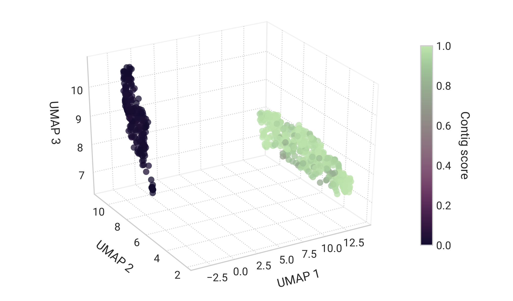

# Composition module

Contigs assembled from reads derived from the same genome or from genomes of closely related organisms tend to display a similar sequence composition profile, represented as k-mer frequencies. Metagenomic binners exploit this property to cluster contigs into putative genomic bins using 4-mer frequencies, or tetranucleotide frequencies (TNFs).

::: tip Genomic islands and plasmids
Mobile genetic elements such as genomic islands and plasmids usually have a 4-mer composition that is distinct from most of the genome, making them problematic for binning algorithms. Consequently, these elements are usually not retrieved in genomic bins.
:::

Whether or not two given contigs will be clustered into the same genomic bin does not depend exclusively on their TNF profiles. In most modern clustering algorithms local relationships are influenced by other data points, meaning that a given pair of contigs may end up in the same bin or not, depending on the full set contigs that is being clustered. Moreover, most binners also use sequencing coverage information in addition to TNF data to cluster contigs, which may lead to genomic bins that encompass contigs with distinct TNF profiles.

MAGpurify2 processes each genomic bin individually and finds potential contaminants with respect to TNF profile by identifying contigs that fall outside of the "core cluster" within the bin.

## How it works

To identify putative contaminants within a genomic bin, MAGpurify2: (1) computes the TNF profile of each contig, (2) embbeds data points into a low-dimentional space using a non-linear transformation, and (3) finds the "core cluster" and computes each contig score.

The four DNA bases (A, T, C and G) can produce $4^4 = 256$ distinct 4-mers, however, in a strand-independent analysis, reverse complement k-mers (eg.: `TTAC` and `GTAA`) are redundant and should be counted as a single entity (a canonical k-mer) in order to reduce memory usage and data variance. Thus, MAGpurify2 counts the 136 canonical 4-mers ($k$) for each contig ($i$) within the bin and computes their relative frequencies as a maximum-likelihood estimation ($q$) of the underlying TNF profile of the sequence:

$$
q_{k,i} = \frac{\mathit{TNF}_{k,i}}{\sum _{k=1}^{136}\:\mathit{TNF}_{k,i}}
$$

::: tip TNF profile of short contigs
Short contigs contain a reduced number of 4-mers and therefore provide less reliable estimations of the underlying genomic TNF profile than longer contigs. This is one of the reasons why most binners filter out contigs shorter than a set threshold (usually around 2,000 bp) before clustering.

MAGpurify2 currently does not take into account the length-dependent statistical uncertainty of the TNF estimation when identifying putative contaminants.
:::

The high dimensional 4-mer frequency data ($q$) is then non-linearly projected into a three dimensional space using the [UMAP](https://umap-learn.readthedocs.io/en/latest/) algorithm, which will bring similar data points together and distance contigs with distinct TNF profiles. Next, [hdbscan](https://hdbscan.readthedocs.io/en/latest/) is used to identify clusters within the UMAP embedding and, if at least one cluster is found, compute the membership level of each contig to the "core cluster". Here, "core cluster" is defined as the cluster that encompassess the largest assembled fraction, that is, the sum of the lengths of all the contigs within the cluster.

As UMAP is a non-deterministic algorithm, MAGpurify2 executes multiple iterations of the dimension reduction and clustering steps. The final contig score corresponds to the average of its membership level to the "core cluster" across the iterations.

## GC content

Lorem ipsum dolor sit amet, consectetur adipiscing elit. Nam id nulla ac velit elementum tempus non eget urna. Etiam placerat leo ac risus semper feugiat ut id nulla. Fusce venenatis magna non feugiat convallis.

Lorem ipsum dolor sit amet, consectetur adipiscing elit. Nam id nulla ac velit elementum tempus non eget urna. Etiam placerat leo ac risus semper feugiat ut id nulla. Fusce venenatis magna non feugiat convallis.

