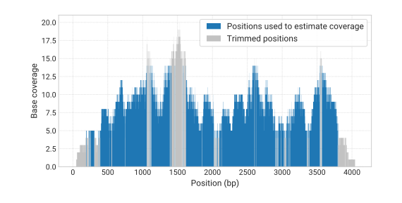

# Coverage module

Contigs originated from the same genome are physically linked, so it is expected that they have a similar abundances (quantified as the average sequencing coverage) within a sample and correlated relative abundances across multiple samples. MAGpurify2 identifies putative contaminants by findings contigs with outlier coverage values in relation to the bin's profile.

::: tip Uneven coverage across a genome
Even though metagenome binners assume a approximately uniform sequencing coverage across the genomes, there are factors of both technical and biological nature that lead to uneven coverage of contigs originated from the same genome. Three major causes of nonuniform genome coverage are: (1) GC content sequencing bias, that cause a coverage reduction in GC-rich regions; (2) repeat genomic regions, that exhibit copy number-dependent coverage; and (3) differences in replication rates. Regarding the latter, regions of the genome that are closer to the replication origin tend to have higher coverage than origin-distal sequences and the magnitude of this gradient depends on the genomic replication rate [^1].
:::

## Computing the relative contig average coverage

When read mappings are supplied by the user, MAGpurify2 processes the alignments to ensure that the coverage estimates are as accurate as possible. This is achieved by employing the following filters:

- Reads that map to the edges of the contig (75 bp) are excluded from coverage computation. These regions are unreliable for coverage estimation as read mappers have trouble to partially align reads that would extend off edges.

- Reads that map to the contig with an alignment identity lower than a specified threshold (97%, by default) are discarded. As species are typically defined as genome clusters with an average nucleotide identity of at least 95%, this filter removes reads that are likely to be originated from a distinct species.

- Variations in sequence conservation across species, the presence of repeat regions, sequencing biases, and sampling biases can all cause different regions within the same contig to have very distinct read coverages (see box above). To prevent large within-contig coverage variations from shifting the estimated contig coverage, MAGpurify2 trims the lower and upper tails of the within-coverage distribution (5% of each, by default) before taking the mean.

After performing read filtering, MAGpurify computes the absolute average coverage ($a$) of each contig ($i$) in each sample ($j$):

$$
a_{i,j} = \frac{\mathit{Read\:count}_i}{\mathit{Length}_i - 2 * 75}
$$

To account for differences in sequence depth between different samples, the relative coverage ($c$) of each contig in each sample computed by dividing its absolute coverage by the sample's total coverage:

$$
c_{i,j} = \frac{a_{i,j}}{\sum_{i=1}^{\mathit{N\underline{o}\:contigs}}\:a_{i,j}}
$$

## Lorem ipsum

Lorem ipsum dolor sit amet, consectetur adipiscing elit. Nam id nulla ac velit elementum tempus non eget urna. Etiam placerat leo ac risus semper feugiat ut id nulla. Fusce venenatis magna non feugiat convallis. Maecenas hendrerit orci quis elit pretium aliquet. Nulla lorem lectus, tempus ut sollicitudin nec, ultricies eu ex. Morbi at fringilla nunc, eget facilisis enim. Nullam a iaculis massa. Sed faucibus leo sed consectetur convallis. Aenean diam neque, imperdiet et mauris nec, mollis dignissim sapien. Vestibulum imperdiet magna a erat pellentesque, porta laoreet enim dapibus. Quisque vitae egestas enim. Donec in lacus volutpat dolor malesuada aliquet. Maecenas eget blandit ipsum. Vivamus eget posuere tortor.

[^1]: Skovgaard, Ole, et al. ["Genome-wide detection of chromosomal rearrangements, indels, and mutations in circular chromosomes by short read sequencing."](https://genome.cshlp.org/content/21/8/1388) *Genome Research* (2011).