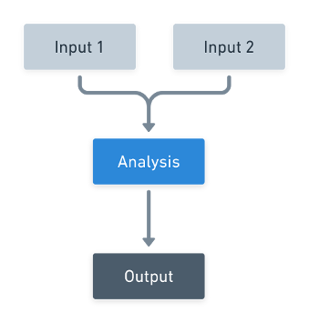

# Introduction

Metagenome-assembled genomes (MAGs) are genomic sequences extracted from broader metagenomic assemblies. This is acomplished through the binning of contigs that share similar sequence properties and display correlation regarding the sequencing coverage across different environmental conditions.

Due to technical limitations of sequencing, metagenomic assembly and binning, MAGs are usually fragmented, incomplete and display varying degrees of contamination (i.e. sequences from a different organism). This last problem is specially concearning because it can affect biological interpretations that assume that a given MAG represents a single species.

MAGpurify2 aims to improve the quality of MAGs through the identification and removal of contaminant sequences, improving the reliability of downstream analysis of the genomic sequences.

## How MAGpurify2 works

 Lorem ipsum dolor sit amet, consectetur adipiscing elit. Morbi vitae orci lectus. Donec gravida facilisis mattis. Aenean molestie mi orci, at pretium eros convallis eu. Morbi vehicula magna libero, sit amet pellentesque elit tempor et. Aliquam erat volutpat. Nulla ut lectus mollis, pretium nibh eu, consectetur massa. Aliquam eget lacinia mauris.